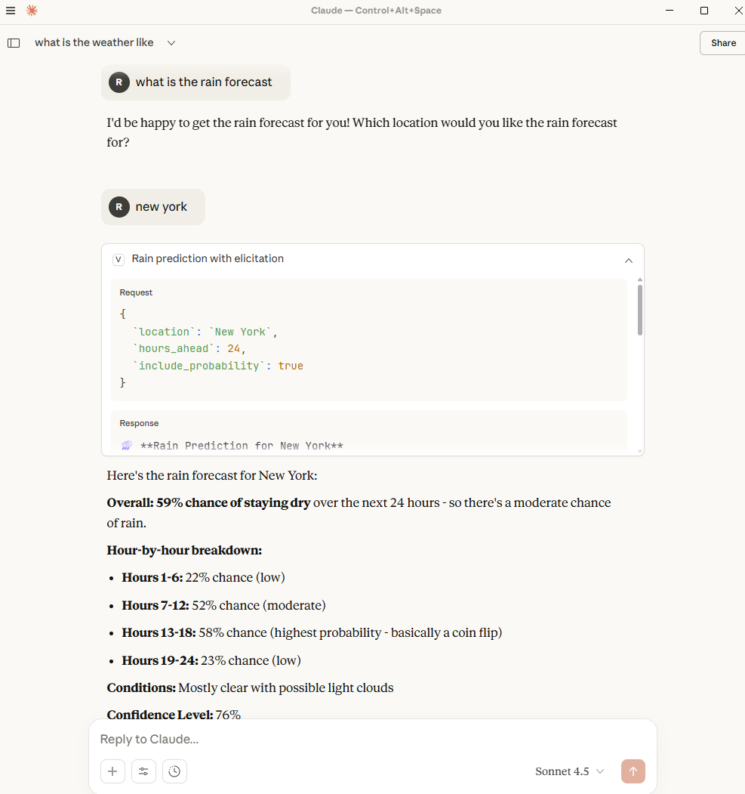

# Vaali MCP Server


## ☁️ One-Click Azure Deployment

[](https://portal.azure.com/#create/Microsoft.Template/uri/https%3A%2F%2Fraw.githubusercontent.com%2Fushakrishnan%2FVaali_MCP_Server%2Fmain%2Finfra%2Fazuredeploy.json)

**Deploy your own MCP Server for learning and experimentation!** • **B1 Basic tier** • **Cost-effective defaults**

### 💰 **Cost Information** *(October 2025)*

**⚠️ Important:** Costs vary significantly by region and change over time. Always check current [Azure App Service pricing](https://azure.microsoft.com/pricing/details/app-service/) for your region before deploying.

**💡 Cost Factors:**
- **App Service runs 24/7** - You're charged for the full month regardless of usage
- **B1 Basic tier** is the most cost-effective starting point
- **Regional variation** - US regions typically cost less than Asia Pacific
- **Outbound data transfer** charges may apply for high-traffic scenarios

**🎯 Recommendation:** Start with B1 Basic tier and monitor actual costs in Azure Cost Management

A **Model Context Protocol (MCP) server** that demonstrates advanced AI agent capabilities through interactive parameter collection and contextual workflow automation, featuring both official MCP elicitation and intelligent parameter guidance patterns.

## 📑 Table of Contents

- [One-Click Azure Deployment](#-one-click-azure-deployment)
- [What is This?](#-what-is-this)
- [Technical Innovation](#-technical-innovation-for-researchers)
- [Quick Start](#-quick-start)
- [Complete Azure Deployment Guide](#-complete-azure-deployment-guide)
- [Configuration Guide](#-configuration-guide)
- [Complete MCP Implementation](#-complete-mcp-implementation)
- [Documentation](#-learn-more)
- [VS Code Integration](#-vs-code-integration)
- [What Makes This Special](#-what-makes-this-special)
- [Research Applications](#-research-applications)
- [Project Status](#-project-status)

## 🎯 What is This? 

**Vaali** makes AI assistants (like Claude) **smarter and more helpful** by giving them:
- 🔧 **Tools** they can use (weather, calculations, text analysis)
- 📋 **Prompts** that guide complex workflows  
- 📁 **Resources** with your data and preferences
- 🤖 **Interactive parameter collection** that asks for missing information intelligently

**Simple Example:**
```
You: "What's the weather like?"

With Elicitation-Capable Client:
✨ Interactive form appears asking for location
📍 You enter "Seattle, WA"  
🌤️ "Current weather in Seattle: 45°F, Cloudy"

With Standard Client:
📋 "I can help with weather! Please provide your location:
   • City: 'Seattle', 'London', 'Tokyo'
   • City with region: 'Austin, TX', 'Paris, France'
   Or enter any city name..."
```

### 📸 Real Claude Desktop Elicitation in Action

Here's how the Vaali MCP server's elicitation looks in Claude Desktop:



*Screenshot showing Claude Desktop's interactive parameter collection with the Vaali MCP server - demonstrating the seamless user experience of hybrid elicitation patterns.*

## 🧠 Technical Innovation (For Researchers)

This project implements **both official MCP elicitation and intelligent parameter guidance patterns**, demonstrating comprehensive approaches to interactive parameter collection in AI agent workflows.

### Hybrid Approach: Two Complementary Methods

1. **🔥 Official MCP Elicitation** (NEW): Interactive workflows that collect missing parameters DURING tool execution
   - Server directly requests structured data from clients using `server.elicitInput()`
   - JSON schema-driven forms and dialogs in supporting clients
   - Accept/decline/cancel response model with immediate parameter collection
   - Standardized protocol feature for enhanced user experience

2. **📋 Parameter Guidance Pattern**: Universal compatibility approach using existing MCP features
   - Works with ANY MCP client through intelligent error handling and contextual guidance
   - Rich contextual help, examples, and intelligent suggestions
   - Client-side intelligence for error recovery and preference learning

### Key Technical Contributions

- **🚀 Interactive Workflows**: Tools that start execution and collect missing parameters progressively
- **🔄 Hybrid Compatibility**: Same tools work with elicitation-capable AND standard MCP clients
- **🛡️ Graceful Fallbacks**: Automatic detection of client capabilities with appropriate response patterns
- **🎯 Progressive Enhancement**: Enhanced experience for capable clients, universal functionality for all
- **📊 Comprehensive Implementation**: Full MCP server with resources, tools, prompts, and elicitation

### Research Significance

- **Interactive AI Workflows**: Demonstrates how tools can seamlessly collect parameters during execution
- **Protocol Evolution**: Shows official MCP elicitation working alongside existing parameter guidance
- **Universal Compatibility**: Single implementation works across all MCP client capabilities
- **User Experience**: Progressive enhancement from error messages to interactive forms
- **Hybrid Architecture**: Best of both worlds - standardized elicitation + universal fallbacks

## 🚀 Quick Start

### Prerequisites
- Node.js 18+ 
- VS Code (recommended)

### Installation & Testing
```bash
# Clone and setup
git clone <repository-url>
cd vaali

# Install dependencies
npm install

# Build the project
npm run build

# Test elicitation concepts (educational walkthrough)
npm run test:advanced-concept

# Test with real MCP clients
npm run test:working-advanced

# Run all tests
npm run test:all

# Start server for Claude Desktop (stdio mode)
npm run start:stdio

# Start server with SSE transport (for debugging)
npm run start:sse
```

### Claude Desktop Integration

Add to your Claude Desktop configuration file:

**Windows:** `%APPDATA%\Claude\claude_desktop_config.json`  
**macOS:** `~/Library/Application Support/Claude/claude_desktop_config.json`  
**Linux:** `~/.config/Claude/claude_desktop_config.json`

```json
{
  "mcpServers": {
    "vaali": {
      "command": "node",
      "args": ["C:/absolute/path/to/vaali/lib/src/index.js", "stdio"],
      "cwd": "C:/absolute/path/to/vaali"
    }
  }
}
```

> **Note:** Use absolute paths for reliable operation. Replace with your actual project path.

Then try natural language commands:
```
"What's the weather in Tokyo?"
"Generate a weather report for Alice"
"Calculate 25 * 4 + 10"
"Test the elicitation tool"
```

## 🏗️ Complete MCP Implementation

This server demonstrates all four MCP capabilities working together:

### ✅ Resources (Static Data)
- **config**: Application configuration and settings
- **sample-data**: User profiles and preferences  
- **readme**: Project documentation

### ✅ Tools (Interactive Functions)
- **Weather Tools**: Current conditions, forecasts, location lookup
- **Analysis Tools**: Text analysis, calculations, data processing
- **Elicitation Tools**: Interactive parameter collection testing

### ✅ Prompts (Workflow Templates)
- **Weather Report Generator**: Multi-step personalized reports
- **Code Review**: Structured review checklists
- **Documentation Writer**: Comprehensive documentation generation

### ✅ Elicitation (Interactive Parameter Collection)
- **Official MCP Elicitation**: JSON schema-driven interactive forms
- **Parameter Guidance**: Universal compatibility with rich contextual help
- **Hybrid Implementation**: Automatic fallback for maximum compatibility

## 📚 Learn More

### For Users & Beginners
- **[docs/CLAUDE_DESKTOP_GUIDE.md](docs/CLAUDE_DESKTOP_GUIDE.md)** - Complete Claude Desktop usage guide
- **[docs/README.md](docs/README.md)** - Documentation index and navigation

### For Developers
- **[docs/IMPLEMENTATION_COMPREHENSIVE_GUIDE.md](docs/IMPLEMENTATION_COMPREHENSIVE_GUIDE.md)** - Complete technical implementation
- **[docs/test-documentation.md](docs/test-documentation.md)** - Testing suite documentation

### For Researchers
- **[docs/ELICITATION_COMPREHENSIVE_GUIDE.md](docs/ELICITATION_COMPREHENSIVE_GUIDE.md)** - Elicitation patterns and best practices
- **[docs/ADVANCED_IMPLEMENTATION_SUMMARY.md](docs/ADVANCED_IMPLEMENTATION_SUMMARY.md)** - Technical architecture overview

## 🎮 VS Code Integration

| Debug Mode | Purpose | How to Use |
|------------|---------|-----------|
| **Agent Builder** | Test with AI Toolkit | F5 → "Debug in Agent Builder" |
| **MCP Inspector** | Protocol debugging | F5 → "Debug SSE in Inspector" |
| **STDIO Mode** | Client integration | F5 → "Debug STDIO in Inspector" |

## 🔬 What Makes This Special

### For Undergraduates: **Interactive AI Tools**
Instead of rigid forms, AI tools can **collect information naturally** during conversation - like asking for your location when you ask about weather, or your email subject when sending messages.

### For Graduate Students: **Dual-Mode Parameter Collection**
Implements **two complementary approaches**: official MCP elicitation for rich interactive forms in supporting clients, plus universal parameter guidance that works with any MCP client through intelligent error handling and prompts.

### For PhD Researchers: **Hybrid Protocol Architecture**
Demonstrates **progressive enhancement** in structured protocols - tools automatically detect client capabilities and provide optimal user experience (interactive forms) while maintaining universal compatibility (guidance fallbacks). Shows how to evolve protocols without breaking existing implementations.

## 🧪 Research Applications

- **Interactive AI Workflows**: How tools can seamlessly collect parameters during execution
- **Protocol Enhancement**: Extending MCP with progressive capabilities while maintaining compatibility
- **User Experience Design**: From error messages to interactive forms to natural conversation
- **Client-Server Architecture**: Capability detection and graceful degradation patterns
- **Hybrid System Design**: Combining standardized protocols with intelligent behaviors

## 🎯 Project Status

✅ **Complete MCP implementation** with all four capabilities (resources, tools, prompts, elicitation)  
✅ **Interactive workflow tools** that collect parameters during execution  
✅ **Hybrid compatibility** - works with elicitation-capable AND standard clients  
✅ **Comprehensive testing suite** demonstrating interactive workflows  
✅ **Claude Desktop integration** with natural language usage  
✅ **Learning-focused** server architecture for education and experimentation  
✅ **MIT Licensed** - Open source and ready for contributions

Built on MCP SDK 1.7.0 and demonstrates interactive AI tool capabilities for learning purposes.

## ☁️ Complete Azure Deployment Guide

Deploy your own instance of the Vaali MCP Server to Azure App Service:

[](https://portal.azure.com/#create/Microsoft.Template/uri/https%3A%2F%2Fraw.githubusercontent.com%2Fushakrishnan%2FVaali_MCP_Server%2Fmain%2Finfra%2Fazuredeploy.json)

### 🎯 **What the Deploy Button Does:**

When you click "Deploy to Azure", you'll see a form asking for:

1. **Subscription** - Select your Azure subscription
2. **Resource Group** - Create new (recommended: `vaali-mcp-rg`) or use existing
3. **Web App Name** - Enter a globally unique name (e.g., `my-vaali-mcp-server`)
4. **App Service Plan Name** - Enter a plan name (e.g., `my-vaali-mcp-server-plan`)
5. **Pricing Tier** - Choose based on your needs:
   - **B1** (default) - Perfect for demos and learning
   - **B2** - Better for team development  
   - **S1** - Production with staging slots

**💡 Tip:** Start with B1 Basic - you can always upgrade later!

**📍 Location:** Resources are automatically deployed to the same region as your resource group for optimal performance and cost.

### 💰 **Pricing Tiers Explained:**

| Tier | Relative Cost | CPU | RAM | Use Case | Recommendation |
|------|---------------|-----|-----|----------|----------------|
| **B1 Basic** | **Lowest** | 1 vCPU | 1.75 GB | Demos, learning, light development | ✅ **Recommended for most users** |
| **B2 Basic** | **2x B1** | 2 vCPU | 3.5 GB | Higher traffic, multiple concurrent users | Good for team demos |
| **S1 Standard** | **~5x B1** | 1 vCPU | 1.75 GB | Production + staging slots, backup | Production environments |
| **S2 Standard** | **~10x B1** | 2 vCPU | 3.5 GB | High-performance production | Enterprise use |

### 🎯 **Which Tier Should I Choose?**

#### **For Learning & Demos** → **B1 Basic** ✅
- Most cost-effective option
- Handles several concurrent Claude Desktop connections
- Perfect for testing elicitation features

#### **For Team Development** → **B2 Basic**
- Double the performance of B1 for 2x the cost
- Can handle more simultaneous MCP connections
- Good for workshops or team demos

#### **For Production** → **S1 Standard**
- Includes deployment slots for staging
- Automatic backup capabilities  
- Better SLA and support options

### 💡 **Performance Expectations:**
- **B1**: ~10-20 concurrent MCP connections
- **B2**: ~20-50 concurrent MCP connections  
- **S1+**: 50+ concurrent connections with enterprise features

### 📊 **Cost Comparison:**
```
Personal Learning:     B1 = Base Cost      (👍 Recommended)
Small Team (2-5):      B1 = Base Cost      
Medium Team (5-15):    B2 = 2x Base Cost
Production/Enterprise: S1 = ~5x Base Cost (includes staging)
```

**💸 Cost Optimization Tips:**
- Start with **B1** for development and testing
- Upgrade only when you need more performance
- Monitor usage through Azure Cost Management
- Check current Azure pricing for your region

**⚠️ Note:** App Service runs continuously 24/7 and charges for the full month regardless of usage

### 🚀 **What Gets Created:**
- ✅ **App Service Plan** (Linux, your chosen tier)
- ✅ **Web App** (Node.js 18, configured for MCP)
- ✅ **HTTPS endpoint** automatically enabled
- ✅ **Environment variables** pre-configured for SSE transport

**💡 Pricing Note:** Costs vary by region and time. B1 Basic is the most cost-effective starting point.

### 📍 **After Deployment:**
Your server will be available at:
- **Main URL:** `https://your-app-name.azurewebsites.net`
- **SSE Endpoint:** `https://your-app-name.azurewebsites.net/sse`

### ⚡ **Alternative Deployment Methods:**
```bash
# Using Azure Developer CLI (azd)
azd auth login
azd up

# Using Azure CLI directly  
az group create --name vaali-mcp-rg --location eastus
az deployment group create \
  --resource-group vaali-mcp-rg \
  --template-file infra/main.bicep \
  --parameters webAppName=my-unique-vaali-server
```

### 🔄 **GitHub Actions CI/CD Setup (Automatic Deployment):**

**✨ Now with automatic deployment!** The workflow triggers on every push to main branch.

For continuous deployment from your GitHub repository:

1. **Fork this repository** to your GitHub account

2. **Create Azure Service Principal:**
   ```bash
   az ad sp create-for-rbac --name "vaali-mcp-github" \
     --role contributor \
     --scopes /subscriptions/YOUR_SUBSCRIPTION_ID \
     --sdk-auth
   ```

3. **Add GitHub Secret:**
   - Go to your forked repo → Settings → Secrets and variables → Actions
   - Click "New repository secret"
   - Name: `AZURE_CREDENTIALS`
   - Value: Paste the entire JSON output from step 2

4. **Automatic Deployment:** 
   - ✅ **Push to main** → Automatically deploys to Azure
   - ✅ **Merge PR** → Automatically deploys to Azure  
   - ✅ **Manual trigger** → Use "Run workflow" button

**🎯 Smart Deployment Logic:**
- **Skips deployment** if AZURE_CREDENTIALS not configured (shows setup instructions)
- **Builds and tests** on every push (even without Azure credentials)
- **Deploys only** when credentials are available and code changes
- **Ignores documentation changes** (*.md files, docs/) for efficiency

**✨ What the automated workflow does:**
- ✅ Builds and tests the project on every push
- ✅ Creates Azure infrastructure automatically (if needed)
- ✅ Deploys the application to Azure App Service
- ✅ Configures production settings (NODE_ENV, PORT, etc.)
- ✅ Runs health checks and provides deployment URLs
- ✅ Shows helpful setup instructions if credentials missing

**🎯 Workflow Features:**
- **Manual Deployment:** Use "Run workflow" button for on-demand deploys
- **Auto Deployment:** Automatically deploys on push to main branch or merged PRs
- **Environment Support:** Production and staging environment options
- **Health Monitoring:** Automatic endpoint validation after deployment
- **Smart Skipping:** Only deploys when Azure credentials are configured

**💰 For current pricing:** Check [Azure App Service Pricing](https://azure.microsoft.com/pricing/details/app-service/) for your region.

## 🔧 Configuration Guide

### 📱 Local Development Setup

**For Claude Desktop Integration (Recommended for development):**

1. **Build the project:**
   ```bash
   npm install
   npm run build
   ```

2. **Configure Claude Desktop:**
   
   **Windows:** Edit `%APPDATA%\Claude\claude_desktop_config.json`  
   **macOS:** Edit `~/Library/Application Support/Claude/claude_desktop_config.json`  
   **Linux:** Edit `~/.config/Claude/claude_desktop_config.json`

   ```json
   {
     "mcpServers": {
       "vaali": {
         "command": "node",
         "args": ["C:/absolute/path/to/vaali/lib/src/index.js", "stdio"],
         "cwd": "C:/absolute/path/to/vaali",
         "env": {
           "NODE_ENV": "development"
         }
       }
     }
   }
   ```

3. **Test the connection:**
   - Restart Claude Desktop
   - Try: "What tools do you have available?"
   - Try: "Test the elicitation tool for rain prediction"

**For Local SSE Testing:**
```bash
# Start server in SSE mode
npm run start:sse

# Test connection
curl http://localhost:3001/sse
```

### ☁️ Azure Production Setup

**After deploying to Azure, your server will be available at:**
- **Main URL:** `https://vaali-mcp-server.azurewebsites.net`
- **SSE Endpoint:** `https://vaali-mcp-server.azurewebsites.net/sse`

**For MCP clients that support SSE transport:**

```javascript
// Example: Connecting to Azure-deployed Vaali server
const { SSEClientTransport } = require('@modelcontextprotocol/sdk/client/sse.js');
const { Client } = require('@modelcontextprotocol/sdk/client/index.js');

const client = new Client(
  {
    name: "vaali-client",
    version: "1.0.0"
  },
  {
    capabilities: {}
  }
);

const transport = new SSEClientTransport(
  new URL('https://your-app-name.azurewebsites.net/sse')
);

await client.connect(transport);
```

**For web applications:**
```html
<!-- Direct SSE connection from browser -->
<script>
const eventSource = new EventSource('https://your-app-name.azurewebsites.net/sse');
eventSource.onmessage = function(event) {
  console.log('MCP Message:', event.data);
};
</script>
```

## 🔀 Transport Protocols Explained

### **STDIO Transport (Local)**
- **Use case:** Direct integration with Claude Desktop
- **How it works:** Process-to-process communication
- **Advantages:** Low latency, secure, no network overhead
- **Configuration:** Claude Desktop config file

### **SSE Transport (Azure/Web)**
- **Use case:** Web-based MCP clients, cloud deployments
- **How it works:** HTTP Server-Sent Events
- **Advantages:** Works through firewalls, web-compatible, scalable
- **Configuration:** HTTP endpoint URL

## 🧪 Testing Your Deployment

### **Local Testing (STDIO):**
```bash
# Test basic functionality
npm run test:advanced-concept

# Test with Claude Desktop
# 1. Configure Claude Desktop (see above)
# 2. In Claude: "What's the weather in Tokyo?"
# 3. In Claude: "Test the elicitation tool"
```

### **Azure Testing (SSE):**
```bash
# Health check
curl https://your-app-name.azurewebsites.net/sse

# Test MCP capabilities
curl -X POST https://your-app-name.azurewebsites.net/messages \
  -H "Content-Type: application/json" \
  -d '{"jsonrpc": "2.0", "id": 1, "method": "initialize", "params": {"protocolVersion": "2024-11-05", "capabilities": {}, "clientInfo": {"name": "test", "version": "1.0.0"}}}'
```

## 🔧 Environment Variables

### **Local Development:**
```bash
NODE_ENV=development
TRANSPORT=stdio
```

### **Azure Production:**
```bash
NODE_ENV=production
TRANSPORT=sse
PORT=3001
WEBSITE_NODE_DEFAULT_VERSION=18-lts
SCM_DO_BUILD_DURING_DEPLOYMENT=true
```

## 🚀 Quick Start Examples

### **Try These Commands in Claude Desktop (Local):**
```
"What's the weather in Seattle?"
"Calculate 25 * 4 + 10"
"Analyze the sentiment of 'This is amazing!'"
"Generate a weather report for Alice"
"Test the elicitation tool for rain prediction"
```

### **API Examples for Azure Deployment:**
```bash
# Get weather (via SSE)
curl -X POST https://your-app.azurewebsites.net/messages \
  -H "Content-Type: application/json" \
  -d '{"jsonrpc": "2.0", "id": 1, "method": "tools/call", "params": {"name": "get_weather", "arguments": {"location": "Tokyo"}}}'

# Test elicitation
curl -X POST https://your-app.azurewebsites.net/messages \
  -H "Content-Type: application/json" \
  -d '{"jsonrpc": "2.0", "id": 1, "method": "tools/call", "params": {"name": "rain_prediction_with_elicitation", "arguments": {}}}'
```

## 🎯 Production Considerations

### **Security:**
- HTTPS enforced on Azure deployment
- CORS configured for web access
- No sensitive data in logs

### **Performance:**
- B1 App Service Plan suitable for moderate usage
- Auto-scaling available if needed
- Always-on connections for SSE

### **Monitoring:**
- Application Insights integration available
- Health check endpoint: `/sse`
- Log streaming through Azure portal

### **Cost Optimization:**
- B1 tier: ~$13/month base cost
- No additional charges for MCP requests
- Scale up/down as needed

## 🌟 Key Features

- **🔄 Hybrid Elicitation**: Both official MCP elicitation and universal parameter guidance
- **📊 Full MCP Compliance**: Resources, tools, prompts, and elicitation capabilities
- **🎯 Progressive Enhancement**: Optimal experience based on client capabilities
- **🛡️ Universal Compatibility**: Works with any MCP client
- **🧪 Research-Ready**: Comprehensive examples for academic and industrial research
- **🚀 Production-Ready**: Robust error handling and graceful fallbacks

## 🤝 Contributing

Contributions are welcome! This project demonstrates advanced MCP patterns and is perfect for:

- **Researchers**: Extending elicitation patterns and protocol research
- **Developers**: Adding new tools and improving client compatibility  
- **Students**: Learning about interactive AI workflows and protocol design

### Development Setup
```bash
# Development mode with hot reload
npm run dev:stdio

# Run tests continuously
npm run test:watch

# Debug with VS Code
Press F5 → Select debug configuration
```

### Areas for Contribution
- Additional elicitation patterns and examples
- New interactive tools demonstrating parameter collection
- Client compatibility testing and improvements
- Documentation and educational content
- Performance optimizations and error handling

## 📄 License

This project is licensed under the MIT License - see the [LICENSE](LICENSE) file for details.

---

**Want to understand how interactive workflows transform AI interactions?** Run `npm run test:advanced-concept` for an educational walkthrough!