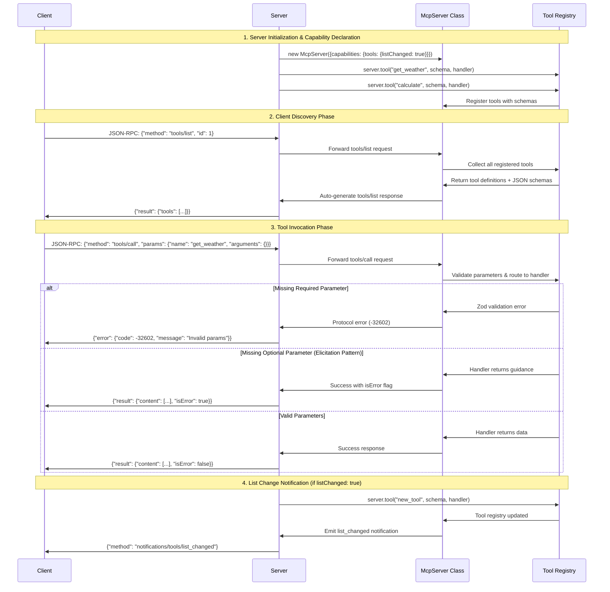

# MCP Tests

This directory contains comprehensive tests for the MCP (Model Context Protocol) server implementation, specifically focusing on tool listing, parameter schemas, and elicitation patterns.

## MCP Tools Discovery Message Flow

Based on the [MCP Tools Specification](https://modelcontextprotocol.io/specification/2025-06-18/server/tools), here's how tools/list discovery works:



## Key Implementation Details

### 1. **Automatic tools/list Implementation**
The `McpServer` class automatically handles the `tools/list` JSON-RPC method:

```typescript
// You declare capabilities
const server = new McpServer({name: "vaali", version: "1.0.0"}, {
  capabilities: {
    tools: {
      listChanged: true  // Server will emit notifications on tool changes
    }
  }
});

// You register tools 
server.tool("get_weather", "Get weather", {
  location: z.string().optional().describe("Location for weather")
}, async ({ location }) => { ... });

// McpServer automatically responds to tools/list with:
{
  "jsonrpc": "2.0",
  "id": 1,
  "result": {
    "tools": [
      {
        "name": "get_weather",
        "description": "Get weather", 
        "inputSchema": {
          "type": "object",
          "properties": {
            "location": {"type": "string", "description": "Location for weather"}
          },
          "required": []  // Empty because z.string().optional()
        }
      }
    ]
  }
}
```

### 2. **Parameter Schema Generation**
Schemas are automatically generated from Zod definitions:

- `z.string()` → required parameter in `inputSchema.required` array
- `z.string().optional()` → optional parameter (not in required array)
- `z.enum(['a', 'b'])` → enum constraint in schema
- `.describe("text")` → description field in schema

### 3. **Error Handling Patterns**

**Protocol Errors** (handled by McpServer):
```json
{"error": {"code": -32602, "message": "Unknown tool: invalid_tool"}}
```

**Tool Execution Errors** (handled by your code):
```json
{"result": {"content": [{"type": "text", "text": "Error message"}], "isError": true}}
```

## Test Files

### 1. `test-mcp-capabilities.mjs`
**Tests MCP Auto-generated Methods**
- Verifies that `tools/list`, `prompts/list`, `resources/list` are automatically provided by McpServer
- Examines server capabilities and initialization
- Demonstrates that you DON'T need to manually implement these list methods

### 2. `test-tools-list.mjs`
**Tests Tool Listing and Parameter Requirements**
- Calls `tools/list` method and examines tool schemas
- Tests parameter validation with required vs optional parameters
- Demonstrates different parameter types (string, boolean, enum)
- Shows how parameter requirements are communicated to clients

### 3. `test-parameter-schemas.mjs`
**Tests Parameter Schemas and Elicitation Patterns**
- Detailed analysis of parameter schemas from Zod definitions
- Tests elicitation scenarios for missing parameters
- Demonstrates complete elicitation flow: error → prompt → retry
- Schema validation examples and edge cases

## Running Tests

### Run All Tests
```bash
npm run test:mcp
```

### Run Individual Tests
```bash
# Test MCP capabilities
npm run test:mcp capabilities

# Test tools listing
npm run test:mcp tools

# Test parameter schemas  
npm run test:mcp parameters
```

### Run Tests Manually
```bash
cd tests
node test-mcp-capabilities.mjs
node test-tools-list.mjs
node test-parameter-schemas.mjs
```

## Key Findings

### 🔧 **tools/list Method**
- ✅ **Automatically provided** by `McpServer` class
- ✅ **You DON'T implement it manually**
- ✅ Returns all tools registered with `server.tool()`
- ✅ Includes parameter schemas derived from Zod definitions

### 📊 **Parameter Requirements**
- ✅ **Derived from Zod schemas** in tool definitions
- ✅ `z.string()` = required parameter
- ✅ `z.string().optional()` = optional parameter
- ✅ `schema.required` array shows required parameters
- ✅ Enum values from `z.enum()` are included in schema

### 🎯 **Elicitation Pattern**
- ✅ **Design pattern, not MCP requirement**
- ✅ Optional parameters allow graceful handling of missing data
- ✅ Return helpful error messages with guidance
- ✅ Suggest elicitation prompts for complex inputs
- ✅ Use `isError: true` flag for programmatic detection

## Test Results Example

```
🔧 Testing MCP Auto-generated Methods and Capabilities

✅ tools/list method works automatically!
📝 Server provides 6 tools

✅ prompts/list method works automatically!  
📝 Server provides 5 prompts

✅ resources/list method works automatically!
📝 Server provides 3 resources

📋 Summary:
- You DON'T need to implement tools/list manually
- You DON'T need to implement prompts/list manually  
- Parameter requirements are inferred from Zod schemas
- McpServer handles all the JSON-RPC routing automatically
```

## Schema Analysis Example

```
🔧 get_weather:
   Parameters: 1 total (0 required, 1 optional)
   Elicitation Pattern: optional_with_guidance
   Parameter Details:
     🟡 location: string
        → Location to get weather for, e.g., city name, state, or coordinates

🔧 text_analyzer:
   Parameters: 2 total (2 required, 0 optional)  
   Elicitation Pattern: required_validation
   Parameter Details:
     🔴 text: string
        → Text to analyze
     🔴 analysis_type: string [basic|detailed|sentiment]
        → Type of analysis to perform
```

## Elicitation Flow

1. **Tool call without required info** → Server returns helpful error/guidance
2. **Client uses elicitation prompt** → Server provides structured help  
3. **Client prompts user** → User provides missing information
4. **Retry tool with complete parameters** → Server returns successful result

## Integration Notes

- **MCP Clients**: Monitor for `isError: true` flag in tool responses
- **MCP Servers**: Make critical parameters optional to enable elicitation
- **Parameter Schemas**: Use Zod for automatic schema generation
- **List Methods**: Rely on McpServer's automatic implementation